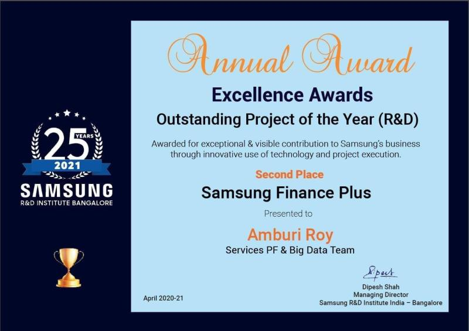

# Amburi Roy

**`Senior Software Engineer`**

I have over 14 years of experience in Software Development. I work on the backend using Node, PHP, and Java; on the frontend, I work with Angular and React. I enjoy building distributed systems, creating microservices, and working with AWS Cloud. I am passionate about system design and always strive to improve code quality. I also enjoy mentoring others and working with teams around the world to create great software.

🔗 [linkedin.com/amburi](https://www.linkedin.com/in/amburi/)  🔗 [amburi.com](https://amburi.com/)  

## Tech Stack

  
  
  
  
  
  
  
  
  
  
  
  
  
  
  
  
  

## Achievements

  
  

## Stats

  
  

## Find Me

 
   
   
   
  

